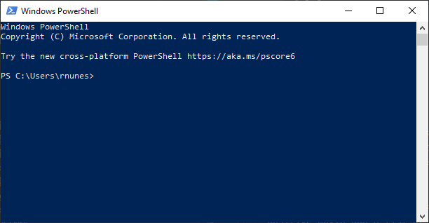
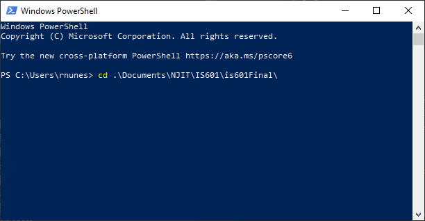
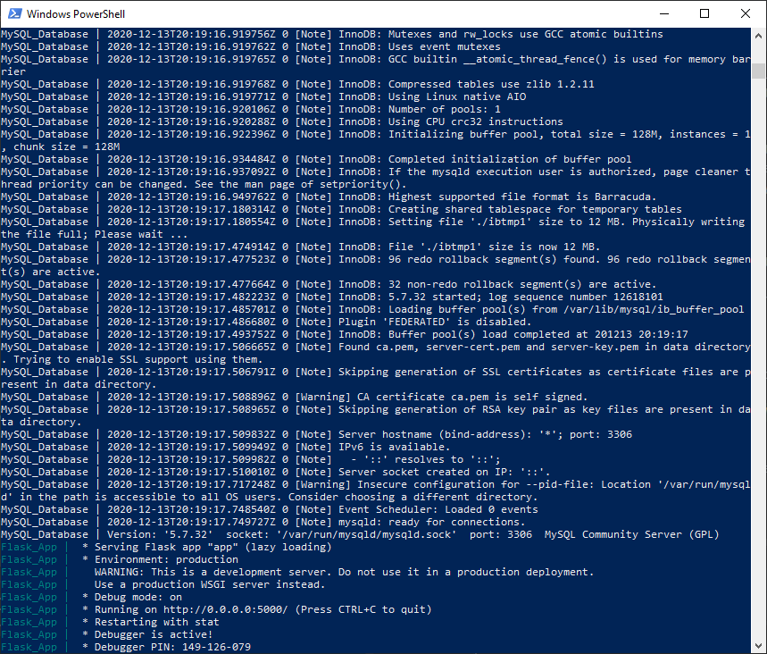
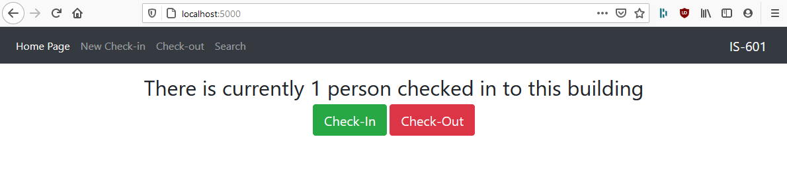

# IS601 - Final Project
## Project by Eric Broderick and Ricardo Nunes

### This project is for a simple Contact Tracing Web-App. It will allow users to "check-in" to a location with their Name, Phone Number, and other optional information.

  - The user data provided along with check-in time as well as a unique session ID will be stored in an SQL database. 

  - On the Check Out Page, the User's Cookie (SessionID) is used to successful log the time a user hits check out and 
    uses the ID it to attach it to their check-in record in the database. This also deletes the cookie from the User's 
    Device and allows them to check in again. 
  
  - The Last page, allows a user to set an Arrival and Departure times which queries the database and will return a list
    of individuals that were checked in within that timeframe. This would be used in the case of someone testing 
    positive COVID and a list of possible people who they may have come in contact with needs to be compiled. 
    
## To Run this Web-App, please follow the procedure below:

  1) Download all project files locally. Make sure you have the app and db folders as well as the docker-compose file.

  2) Move files and directories into desired file location on the local machine. 

  3) Open Windows Powershell or equivalent Command Line tool with Docker command capabilities. 
        
  
  4) Using the Command Line too, navigate to the file location on the local machine where the application files are stored.
        **Example:** *cd .\Documents\NJIT\IS601\is601Final\*
        
  
  5) Run the *docker-compose up* command. 
        
  
  6) Assuming all files were copied over correctly, the web-app should now be running.
        
  
  7) You should now be able to open a web browser and navigate to *http://localhost:5000/* and use the web app.
        