## Home Page
Below is the homepage for the app when it is accessed. There is a button that directs you to the check-in and check-out pages.
There is also a navbar across the top to aid with navigation.   

## New Check-in Page and function
Below is the check-in page. Users must enter their Name, Phone Number, and reason for the visit.

Below you can see the successful POST command from the Docker runtime window.
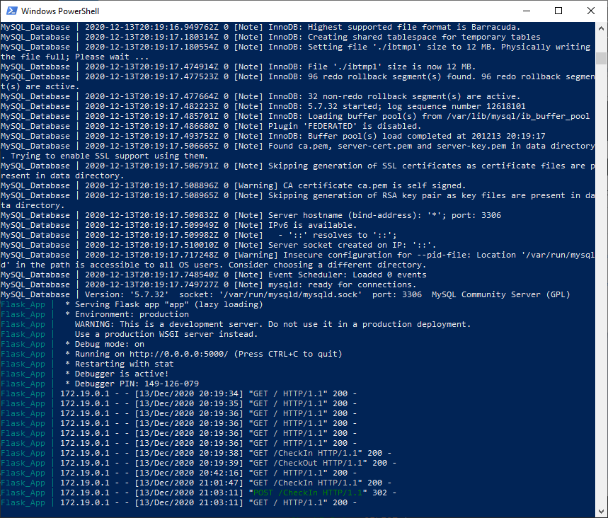
SQL database view before the check-in in the example is executed.
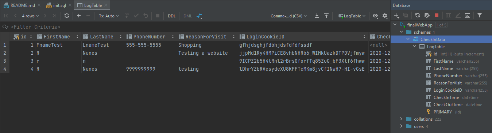
SQL database view after the check-in above is executed and posted.
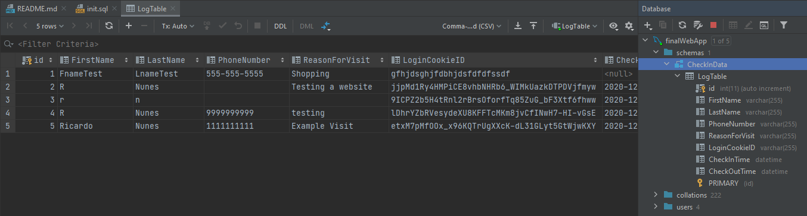
If a user attempts to navigate to the check-in page again before checking out (i.e. has an active cookie) they will be met with the following notice:
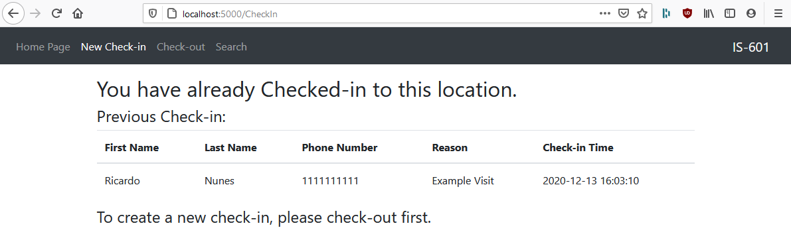
## Check-out Page and function
Below is the simple check-out page. 
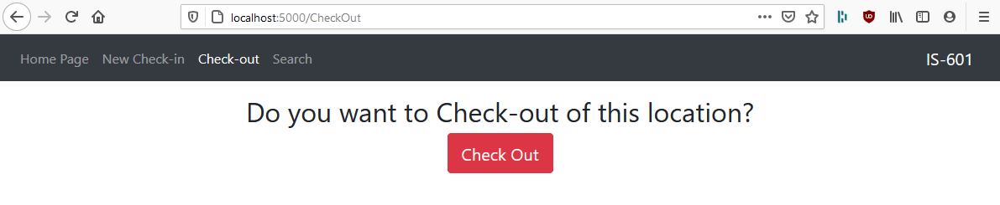
Below you can see the successful POST command from the Docker runtime window.
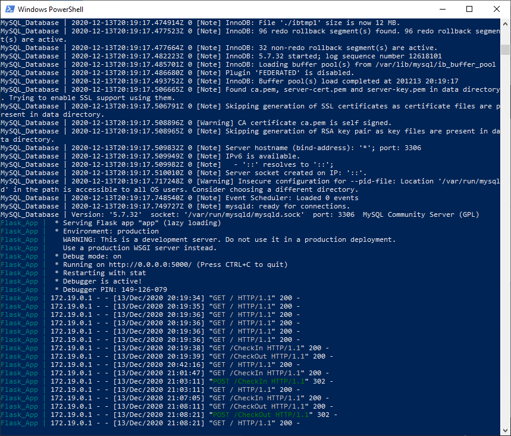
SQL database view before the check-out in the example is executed.
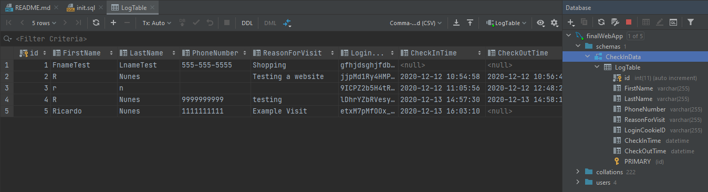
SQL database view after the check-out above is executed and posted.
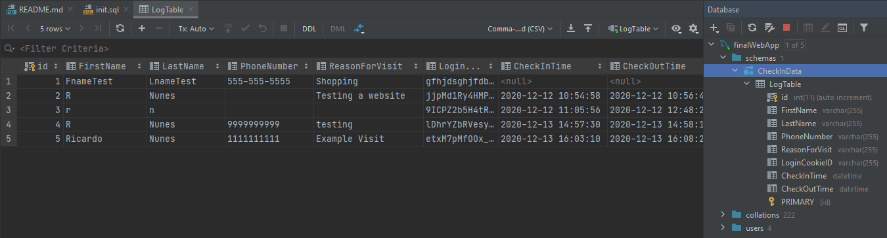
## Search Page and function
Below is the search page. Users must enter a date as well as time range. There is a calendar available to the user to aid with proper selection. 
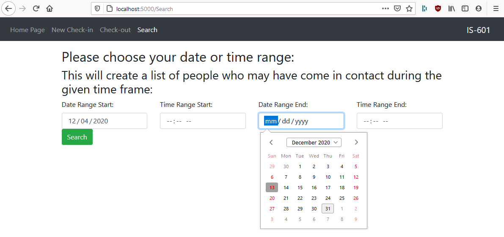
Below you can see the successful GET and POST command from the Docker runtime window.
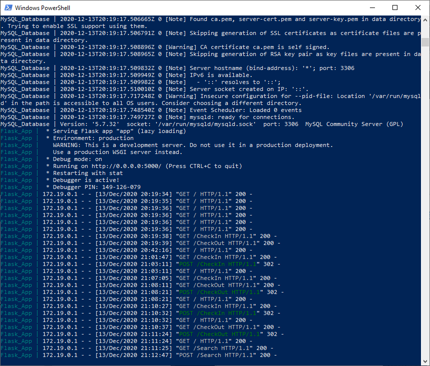
Below is the search result page for the user entered date and time range. 
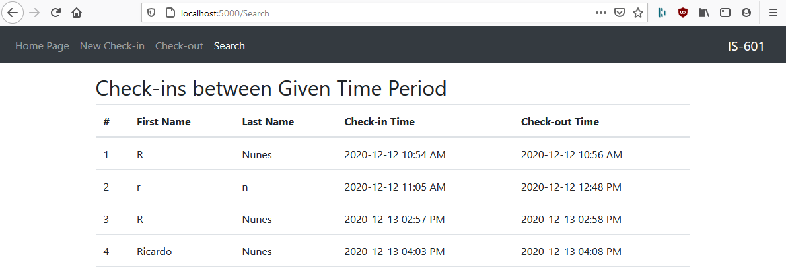
