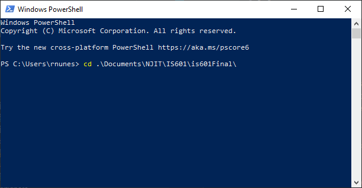
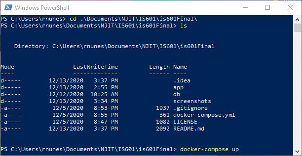

## To Run this Web-App, please follow the procedure below:

  1) Download all project files locally. Make sure you have the app and db folders as well as the docker-compose file.

  2) Move files and directories into desired file location on the local machine. 

  3) Open Windows Powershell or equivalent Command Line tool with Docker command capabilities. 
        
  
  4) Using the Command Line tool, navigate to the file location on the local machine where the application files are stored.
        **Example:** cd .\Documents\NJIT\IS601\is601Final\
        
  
  5) Run the ***docker-compose up*** command. 
        
  
  6) Assuming all files were copied over correctly, the web-app should now be running.
        
  
  7) You should now be able to open a web browser and navigate to *http://localhost:5000/* and use the web app.
        